<div align="center">

# `jeet@github ~ $ whoami`

### Jeet Senapati

**Full Stack Developer · AI & ML Enthusiast · 2026 CS Graduate**

<p>
  <a href="https://github.com/jeet143143">GitHub</a> ·
  <a href="https://www.linkedin.com/in/jeet-senapati/](https://www.linkedin.com/in/jeet-senapati-23921324a/">LinkedIn</a>
</p>

</div>

---

<div align="center">

<h3><code>jeet@github ~ $ ./contributions.sh</code></h3>



<br><br>

<h3><code>jeet@github ~ $ whoami</code></h3>

<table>
  <tr>
    <td valign="top">
      
    </td>
    <td valign="top">
      
    </td>
  </tr>
</table>

</div>

---

<div align="center">

### `jeet@github ~ $ cat about.txt`

</div>

> I'm **Jeet Senapati**, a Computer Science & Information Technology graduate from **UEM Kolkata**, interested in building full-stack products and AI-powered applications.
>
> I enjoy turning ideas into usable products — from real-time communication systems and e-commerce platforms to AI interview coaches and review-analysis tools.
>
> Currently focused on **Java, DSA, backend development, AI/ML, system design, and building production-ready applications.**

---

<div align="center">

### `jeet@github ~ $ cat stack.txt`

</div>

<table align="center">
<tr>
<td align="center" width="50%">

**Languages**

Java · JavaScript · Python · SQL

</td>
<td align="center" width="50%">

**Frontend**

HTML · CSS · JavaScript · React · EJS · Tailwind CSS

</td>
</tr>

<tr>
<td align="center" width="50%">

**Backend**

Node.js · Express.js · REST APIs · JWT

</td>
<td align="center" width="50%">

**Databases**

MongoDB · SQL

</td>
</tr>

<tr>
<td align="center" width="50%">

**AI / ML**

LLMs · Groq · OpenAI · LangChain · AI Chatbots

</td>
<td align="center" width="50%">

**Tools**

Git · GitHub · Vercel · Socket.io · Three.js · GSAP

</td>
</tr>
</table>

---

<div align="center">

### `jeet@github ~ $ ls projects/`

</div>

### `01 · IntervueX`

**AI-Powered Interview Preparation Platform**

A full-stack AI interview coaching platform that simulates realistic mock interviews and provides personalized feedback.

- 🤖 AI-powered mock interviews
- 📄 Resume-powered personalized questions
- 🏢 Company-specific interview patterns
- 🎤 Voice answers with speech-to-text
- 📊 AI evaluation and detailed feedback
- 📈 Progress dashboard and score tracking
- 📑 Resume ATS analyzer
- 💻 Built-in coding notepad

**Stack:** `HTML` `CSS` `JavaScript` `Node.js` `Express.js` `MongoDB` `Groq` `Three.js` `GSAP` `Chart.js` `Web Speech API`

<p>
<a href="https://github.com/jeet143143/IntervueX">View Repository →</a>
</p>

---

### `02 · E-Commerce + AI Review Summarizer`

A full-stack e-commerce application enhanced with AI-powered customer review analysis and conversational support.

- 🛒 E-commerce workflow
- 🗄️ MongoDB-backed application
- ⚙️ Node.js + Express backend
- ✨ Animated frontend
- 🤖 AI-powered review summarization
- 💬 AI chat support

**Stack:** `EJS` `CSS` `JavaScript` `Node.js` `Express.js` `MongoDB` `LangChain` `OpenAI` `Botpress`

<p>
<a href="https://github.com/jeet143143/ecom">View Repository →</a>
</p>

---

### `03 · Real-Time Chat Application`

A real-time messaging application built around modern web communication and authentication.

- 💬 Real-time messaging
- ⚡ Socket.io communication
- 🔐 JWT authentication
- 🗄️ MongoDB persistence
- 📱 Responsive interface

**Stack:** `MERN` `Socket.io` `JWT` `Tailwind CSS`

<p>
<a href="https://github.com/jeet143143/real-chat-app">View Repository →</a>
</p>

---

### `04 · Financial KPI Dashboard`

A dashboard project focused on presenting financial metrics and business performance through a clean visual interface.

**Stack:** `JavaScript` `Data Visualization` `Dashboard UI`

<p>
<a href="https://github.com/jeet143143/financial-kpi-dashboard">View Repository →</a>
</p>

---

<div align="center">

### `jeet@github ~ $ git status`

</div>

```text
On branch main

Currently working on:

+ Java & DSA
+ Backend development
+ AI / ML applications
+ System design
+ Full-stack projects
+ Problem solving
+ Better engineering practices

nothing to commit -- just keep building.
```

---

<div align="center">

### `jeet@github ~ $ cat learning.log`

</div>

```text
[+] Advanced DSA
[+] Java backend development
[+] System design
[+] LLM applications
[+] RAG & AI agents
[+] React & modern frontend
[+] Cloud & deployment
```

---

<div align="center">

### `jeet@github ~ $ ./connect.sh`

<p>
  <a href="senapatijeet2004@gmail.com">📧 Email</a> ·
  <a href="https://www.linkedin.com/in/jeet-senapati/">💼 LinkedIn</a> ·
  <a href="https://github.com/jeet143143">🐙 GitHub</a>
</p>

<br>


</div>

---

<div align="center">

<sub>
Built with code, curiosity, and too many terminal windows.
</sub>

</div>
